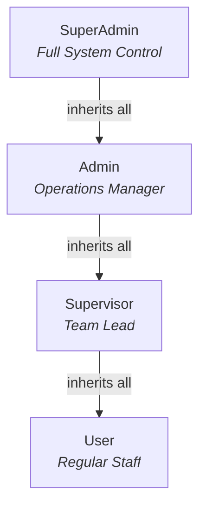
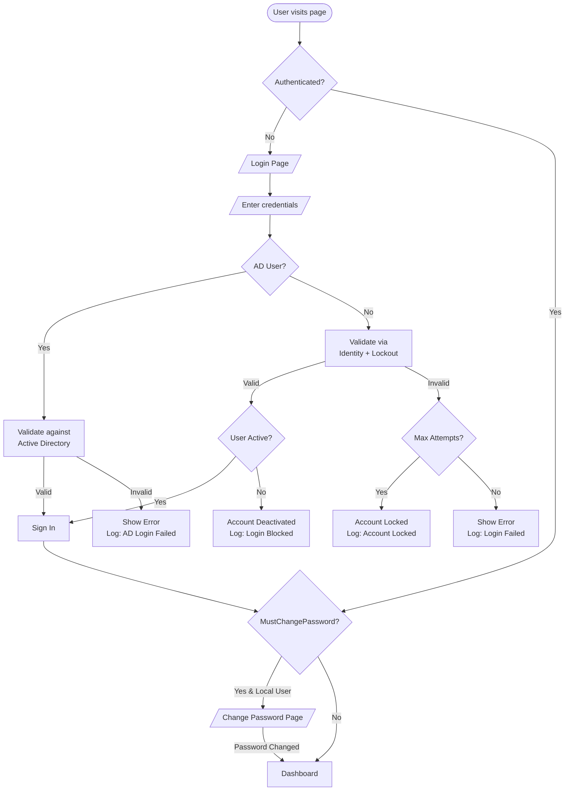
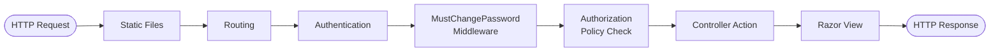
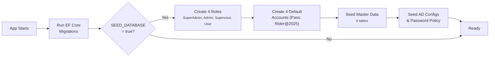

<div align="center">

# Lost & Found Application

**A full-featured, enterprise-grade Lost & Found management system built for local Windows deployment.**


Track, manage, and report on lost & found items with role-based access control, Active Directory integration, file uploads, full audit logging, and more — all running **100% locally** on your own Windows hardware.

[Getting Started](#getting-started) · [User Roles](#user-roles) · [Features](#feature-overview) · [Architecture](#architecture) · [Configuration](#configuration--environment)

</div>

---

## Table of Contents

- [Getting Started](#getting-started)
  - [Prerequisites](#prerequisites)
  - [Step 1: Download & Extract](#step-1-download--extract-the-project)
  - [Step 2: Open in Visual Studio](#step-2-open-the-project-in-visual-studio)
  - [Step 3: Configure MSSQL](#step-3-configure-your-mssql-connection)
  - [Step 4: Run the App](#step-4-run-the-application)
  - [Step 5: Automation](#step-5-system-automation-the-magic)
  - [Step 6: Access the App](#step-6-accessing-the-app)
  - [Troubleshooting](#troubleshooting-quick-check)
- [User Roles](#user-roles)
- [Feature Overview](#feature-overview)
- [Architecture](#architecture)
- [Database Schema](#database-schema)
- [Authentication & Security](#authentication--security)
- [API / Route Reference](#api--route-reference)
- [Services & Business Logic](#services--business-logic)
- [Frontend Architecture](#frontend-architecture)
- [Configuration & Environment](#configuration--environment)
- [Project File Structure](#project-file-structure)

---

## Getting Started

### Prerequisites

Before you begin, ensure your Windows machine has the following:

| # | Software | Notes |
|---|----------|-------|
| 1 | **Visual Studio 2022** (Community, Professional, or Enterprise) | Must include the **"ASP.NET and web development"** workload |
| 2 | **.NET 8.0 SDK** | Usually installed automatically with VS 2022 |
| 3 | **Microsoft SQL Server** (Local) | SQL Server 2022 Express or LocalDB — ensure the service is **running** |

---

### Step 1: Download & Extract the Project

If you are downloading the source code directly from GitHub as a ZIP file:

1. Click the green **"<> Code"** button on the repository page.
2. Select **"Download ZIP"** and save it (e.g., to your `Downloads` folder).
3. ** Windows Security Step:**
 - Right-click the `.zip` file → **Properties**
 - If you see *"This file came from another computer and might be blocked..."*, check the **Unblock** box → **Apply** → **OK**
4. Right-click the `.zip` file → **Extract All...** → Choose a destination (e.g., `C:\Projects\LostAndFound`).

---

### Step 2: Open the Project in Visual Studio

1. Navigate to the extracted folder in File Explorer.
2. Double-click **`LostAndFoundApp.csproj`** (or `.sln` if present) — Visual Studio 2022 will launch.
3. Wait while Visual Studio automatically restores NuGet packages (watch the "Output" window at the bottom).

---

### Step 3: Configure Your MSSQL Connection

1. In **Solution Explorer** (right panel), open **`appsettings.json`**.
2. Find the `ConnectionStrings` section at the top:
 ```json
 "ConnectionStrings": {
 "DefaultConnection": "Server=.\\SQLEXPRESS;Database=LostAndFoundDb;Trusted_Connection=True;TrustServerCertificate=True;"
 }
 ```
3. **Most local installs use `.\SQLEXPRESS`**. If you use LocalDB, change to `(localdb)\\MSSQLLocalDB`.
 - `Trusted_Connection=True` uses your Windows login — no separate DB password needed!

---

### ▶ Step 4: Run the Application

1. In the top toolbar, click the dropdown next to the green **Play** button.
2. Select **"http"**, **"https"**, or **"LostAndFoundApp"** (avoid "IIS Express").
3. Click **▶ Play** (or press **F5**).

---

### Step 5: System Automation (The Magic)

On first run, the app automatically:

| Step | What Happens |
|------|-------------|
| **Database Created** | Connects to your SQL Server and creates `LostAndFoundDb` |
| **Tables Built** | Runs EF Core migrations to generate all required tables |
| **Data Seeded** | Populates default users, roles, statuses, and master data |

> No manual SQL scripts needed — everything is automated!

---

### Step 6: Accessing the App

1. Visual Studio opens your browser to the local address (e.g., `https://localhost:5001`).
2. Log in with one of the default accounts below.
3. Uploaded files are saved to a `SecureStorage/` folder inside your project directory.

---

### Troubleshooting Quick-Check

| Problem | Solution |
|---------|----------|
| App crashes instantly on Play | Verify your MSSQL service is **running** (check SQL Server Configuration Manager or Windows Services) |
| Database Connection Error | Confirm the `Server` name in `appsettings.json` matches your install (e.g., `.\SQLEXPRESS` or `(localdb)\MSSQLLocalDB`) |

---

## User Roles

The application has **four user roles** arranged in a permission hierarchy:



### Default Accounts

> All accounts require a **password change on first login**.

| Role | Username | Password | Description |
|:----:|----------|----------|-------------|
| **SuperAdmin** | `sadmin` | `Rider@2025` | System administrator — full system control |
| **Admin** | `admin` | `Rider@2025` | Operations manager — user management & AD sync |
| **Supervisor** | `supervisor` | `Rider@2025` | Team lead — master data management & team oversight |
| **User** | `user` | `Rider@2025` | Regular staff — registers and edits items |

---

### SuperAdmin — Complete System Control

<table>
<tr><td>

**What SuperAdmin can do:**
- **User Management** — Create, edit, delete user accounts; assign roles; reset passwords
- **AD Synchronization** — Configure AD groups & individual AD users; manual & scheduled sync
- **Password Policy** — Configure system-wide password requirements (stored in database, effective immediately)
- **Announcements** — Create, manage, and target announcements to specific roles
- **Full Dashboard** — Complete system analytics with KPIs, trends, alerts, user stats, AD sync health
- **Master Data** — Full CRUD on all 6 master data tables with soft delete (activate/deactivate)
- **All Logs** — View all activity logs, export as CSV, clear logs
- **Delete Records** — Permanently delete lost & found records (single & bulk)
- **Bulk Operations** — Bulk delete and bulk status update on search results
- **File Management** — Upload, replace, and view photos/attachments

</td></tr>
</table>

---

### Admin — Day-to-Day Operations

<table>
<tr><td>

**What Admin can do:**
- **User Management** — Create users, edit roles, toggle active, reset passwords, delete users
- **AD Management** — Manage AD Groups & individual AD Users, trigger manual sync
- **Full Dashboard** — Operational analytics, user stats, master data health, status breakdown
- **Master Data** — Full CRUD on all master data tables
- **View All Logs** — See activity logs for all users (cannot export or clear)
- **Delete Records** — Permanently delete lost & found records (single & bulk)
- **Messages** — View announcements targeted to their role

**What Admin CANNOT do:**
- Cannot configure Password Policy
- Cannot create or manage Announcements
- Cannot export or clear logs

</td></tr>
</table>

---

### Supervisor — Team Lead

<table>
<tr><td>

**What Supervisor can do:**
- **Master Data** — Full CRUD on all master data tables + inline AJAX creation
- **Dashboard** — Team performance, top contributors, operational KPIs
- **My Logs** — View their own activity history
- **Create & Edit Records** — Full item management with file uploads
- **Search & Print** — Find items with filters, export results
- **Messages** — View announcements targeted to their role

**What Supervisor CANNOT do:**
- Cannot delete any lost & found records
- Cannot access User Management or AD settings
- Cannot view other users' activity logs

</td></tr>
</table>

---

### User — Regular Staff

<table>
<tr><td>

**What User can do:**
- **Create Records** — Register new lost & found items with photos & attachments
- **Edit Records** — Update details of any record
- **Search & Print** — Find items with filters, print results
- **Basic Dashboard** — Status summary and 10 recent records
- **My Logs** — View their own activity history

**What User CANNOT do:**
- Cannot delete any records
- Cannot access Master Data management
- Cannot access User Management, AD settings, or other users' logs

</td></tr>
</table>

---

### Role Comparison Matrix

| Feature | SuperAdmin | Admin | Supervisor | User |
|---------|:---:|:---:|:---:|:---:|
| View Dashboard (Full Analytics) | Full | Full | Team | Basic |
| Create Lost & Found Records | Yes | Yes | Yes | Yes |
| Edit Any Record | Yes | Yes | Yes | Yes |
| Delete Records (Single & Bulk) | Yes | Yes | No | No |
| Bulk Status Update | Yes | Yes | No | No |
| Export Search to CSV | Yes | Yes | Yes | Yes |
| Manage Master Data | Yes | Yes | Yes | No |
| Inline AJAX Master Data Creation | Yes | Yes | Yes | No |
| View All Activity Logs | Yes | Yes | No | No |
| View Own Activity Logs | Yes | Yes | Yes | No |
| Export Logs (CSV) | Yes | No | No | No |
| Clear All Logs | Yes | No | No | No |
| Create / Edit / Delete Users | Yes | Yes | No | No |
| Change User Roles | Yes | Yes | No | No |
| Reset User Passwords | Yes | Yes | No | No |
| Manage AD Groups & Users | Yes | Yes | No | No |
| Trigger AD Sync | Yes | Yes | No | No |
| Configure Password Policy | Yes | No | No | No |
| Manage Announcements | Yes | No | No | No |
| View Messages | Yes | Yes | Yes | Yes |

---

## Feature Overview

| Module | Capabilities |
|--------|-------------|
| **Item Management** | Create, Edit, View Details, Delete, Photo Upload, Attachment Upload, Search & Filter, Print Results, Export CSV, Bulk Delete, Bulk Status Update |
| **Master Data** | Items, Routes, Vehicles, Storage Locations, Statuses, Found By Names — CRUD + Toggle Active + AJAX Inline Create |
| **User Management** | Create Users, Edit Roles, Activate/Deactivate, Delete Users, Reset Passwords, User List with filters |
| **Active Directory** | AD Group Mapping, Individual AD User Mapping, Manual & Scheduled Sync, Role Assignment, Live AD Search, Sync History |
| **Announcements** | Create/Edit/Delete, Role-Targeted Delivery, Popup Notifications (max 3 shows), Message Inbox, Dismiss/Read Tracking |
| **Activity Logs** | Full Audit Trail, Filter by Category/Date/Search, CSV Export, Clear Logs |
| **Password Policy** | Database-Driven Dynamic Policy, SuperAdmin Configurable, Immediate Effect |
| **Security** | Role-Based Auth (4 levels), Dynamic Password Policy, Account Lockout, AD Rate Limiting, CSRF Protection, File Validation, MIME Checking, Security Headers |
| **Dashboard** | Role-Specific Views (4 variants), KPIs, Trends, Alerts, Team Performance, Storage Utilization, AD Sync Health |

### Feature Details

<details>
<summary><b> Lost & Found Item Management</b></summary>

| Feature | Route | Access |
|---------|-------|--------|
| **Create Record** | `GET/POST /LostFoundItem/Create` | All Users |
| **View Details** | `GET /LostFoundItem/Details/{id}` | All Users |
| **Edit Record** | `GET/POST /LostFoundItem/Edit/{id}` | All Users |
| **Delete Record** | `POST /LostFoundItem/Delete/{id}` | Admin+ only |
| **Search / Filter** | `GET /LostFoundItem/Search` | All Users |
| **Print Results** | `GET /LostFoundItem/PrintSearch` | All Users |
| **View Photo** | `GET /LostFoundItem/Photo/{name}` | All Users |
| **Download Attachment** | `GET /LostFoundItem/Attachment/{name}` | All Users |

**Create/Edit Form Fields:**
Date Found · Item (dropdown) · Description · Location Found · Route # · Vehicle # · Storage Location · Status · Status Date · Found By · Claimed By · Notes · Photo Upload · Attachment Upload

**Upload Rules:**
- Photos: `.jpg`, `.jpeg`, `.png`, `.gif` — max 10MB
- Attachments: `.pdf`, `.doc`, `.docx`, `.xls`, `.xlsx`, `.txt`, `.jpg`, `.jpeg`, `.png` — max 10MB
- Total form size: 15MB
- Files renamed to GUIDs, stored outside web root, served through authenticated endpoints only

**Search Features:**
- 9 filter fields (Tracking ID, dates, item, status, route, vehicle, storage, found by)
- Sortable columns (ascending / descending)
- 25 records per page with pagination
- Print view with all results (no pagination)
- Human-readable filter summary

</details>

<details>
<summary><b> Master Data Management</b></summary>

Six master data tables, each with identical CRUD operations:

| Table | Purpose | Name Max Length |
|-------|---------|:---:|
| **Items** | Pieces of lost/found items (Wallet, Phone, Keys…) | 200 |
| **Routes** | Route numbers for transit context | 100 |
| **Vehicles** | Vehicle numbers/identifiers | 100 |
| **Storage Locations** | Physical locations where items are stored | 200 |
| **Statuses** | Item statuses (Found, Claimed, Stored, Disposed, Transferred) | 100 |
| **Found By Names** | Names of people who found items | 200 |

**Operations per table:** List · Create · Edit · Delete · Toggle Active/Inactive

**In-Use Protection:** Cannot delete entries referenced by existing items — must deactivate instead.

**AJAX Inline Creation:** Supervisor+ can create new master data entries directly from item form dropdowns without leaving the page.

</details>

<details>
<summary><b>📢 Announcement System</b></summary>

| Operation | Route | Access |
|-----------|-------|--------|
| **Manage Announcements** | `GET /Announcement` | SuperAdmin only |
| **Create Announcement** | `GET/POST /Announcement/Create` | SuperAdmin only |
| **Toggle Active** | `POST /Announcement/ToggleActive/{id}` | SuperAdmin only |
| **Delete Announcement** | `POST /Announcement/Delete/{id}` | SuperAdmin only |
| **View My Messages** | `GET /Announcement/Messages` | All authenticated users |
| **Dismiss Message** | `POST /Announcement/Dismiss/{id}` | All authenticated users |
| **Get Popups** | `GET /Announcement/GetPopupAnnouncements` | All authenticated users (JSON) |
| **Mark Popup Shown** | `POST /Announcement/MarkPopupShown` | All authenticated users (AJAX) |
| **Unread Count** | `GET /Announcement/UnreadCount` | All authenticated users (JSON) |

**Features:**
- Target announcements to specific roles: `All`, `Admin`, `Supervisor`, `User`
- Popup notifications auto-show on page load (max 3 times per announcement)
- Users can dismiss announcements permanently
- Optional expiry date for time-limited announcements
- Unread badge count in navigation bar
- Multi-announcement carousel with Previous/Next navigation

</details>

<details>
<summary><b> User Management</b></summary>

| Operation | Route | Access |
|-----------|-------|--------|
| **View User List** | `GET /UserManagement` | Supervisor+ (filterable by search/role/status) |
| **Create User** | `GET/POST /UserManagement/Create` | Admin+ |
| **Edit Role** | `GET/POST /UserManagement/EditRole/{id}` | Admin+ |
| **Toggle Active** | `POST /UserManagement/ToggleActive/{id}` | Admin+ |
| **Reset Password** | `POST /UserManagement/ResetPassword/{id}` | Admin+ |
| **Delete User** | `POST /UserManagement/DeleteUser/{id}` | Admin+ |
| **Password Policy** | `GET/POST /UserManagement/PasswordPolicy` | SuperAdmin only |

- New users have `MustChangePassword = true` (forced change on first login)
- Server-side role whitelist prevents arbitrary role injection via crafted POST
- SuperAdmin accounts are invisible to non-SuperAdmin users
- Cannot deactivate or delete your own account (safety check)
- Admin password reset generates a cryptographically secure 12-character temporary password
- AD users cannot have their passwords reset (redirected to organization's password management)
- User list supports pagination (50 per page) with search, role, account type, and status filters

</details>

<details>
<summary><b>📡 Active Directory Integration</b></summary>

| Operation | Route | Access |
|-----------|-------|--------|
| **View AD Groups** | `GET /UserManagement/AdGroups` | Admin+ |
| **Add Groups** | `POST /UserManagement/AddAdGroups` | Admin+ |
| **Update Group Role** | `POST /UserManagement/UpdateAdGroupRole` | Admin+ |
| **Toggle Group** | `POST /UserManagement/ToggleAdGroupActive/{id}` | Admin+ |
| **Remove Group** | `POST /UserManagement/RemoveAdGroup/{id}` | Admin+ |
| **Search AD Groups** | `GET /UserManagement/SearchAdGroups?term=` | Admin+ |
| **View AD Users** | `GET /UserManagement/AdUsers` | Admin+ |
| **Add AD User** | `POST /UserManagement/AddAdUser` | Admin+ |
| **Update AD User Role** | `POST /UserManagement/UpdateAdUserRole` | Admin+ |
| **Toggle AD User** | `POST /UserManagement/ToggleAdUserActive/{id}` | Admin+ |
| **Remove AD User** | `POST /UserManagement/RemoveAdUser/{id}` | Admin+ |
| **Search AD Users** | `GET /UserManagement/SearchAdUsers?term=` | Admin+ |
| **Sync Now** | `POST /UserManagement/SyncNow` | Admin+ |

**Two Sync Modes:**
1. **AD Group Sync** — Map AD security groups to application roles; all members are synced
2. **Individual AD User Sync** — Add specific AD usernames with role mappings

**Sync Engine Behavior:**
1. Reads all active `AdGroup` and `AdUser` configurations
2. Connects to AD using configured domain, container, and SSL settings
3. Processes individual AD users first, then enumerates group members (recursive)
4. Creates new users / updates existing / deactivates removed
5. Role priority: Admin (3) > Supervisor (2) > User (1) — highest wins if in multiple groups
6. AD mappings can only map to Admin, Supervisor, or User — **never SuperAdmin** (security design)

**Safety:** If any AD group fails to process, user deactivation is skipped entirely to prevent false deactivations.

**Background Service:** `AdSyncHostedService` runs sync daily at a configurable hour (default: 2 AM). On failure, retries after a configurable interval (default: 60 minutes).

**Sync History:** Every sync operation (manual or scheduled) is logged to the `AdSyncLogs` table with created/updated/deactivated counts and error summaries.

**Live Search:** Admin+ can search AD for groups and users in real time using autocomplete endpoints that query the domain controller.

</details>

<details>
<summary><b> Activity Logs & Audit Trail</b></summary>

| Operation | Route | Access |
|-----------|-------|--------|
| **View Logs** | `GET /Logs` | All (Users see own only; Admin+ see all) |
| **Export CSV** | `GET /Logs/Export` | SuperAdmin only |
| **Clear All Logs** | `POST /Logs/Clear` | SuperAdmin only |

**Log Categories:** `Auth` · `ADSync` · `UserManagement` · `MasterData` · `Items` · `System`

**Every log entry records:** Timestamp · Action · Details · Performed By · Category · IP Address · Status (Success/Failed)

**CSV Export Security:** Values starting with `=`, `+`, `-`, `@` are prefixed with `'` to prevent formula injection in Excel.

</details>

<details>
<summary><b>📊 Dashboard (4 Role-Specific Views)</b></summary>

The dashboard renders a different view per role: `DashboardUser`, `DashboardSupervisor`, `DashboardAdmin`, `DashboardSuperAdmin`.

**All Roles see:**
- Status summary cards (Total, Found, Claimed, Stored, Disposed, Transferred)
- KPIs: Claim Rate %, Avg Days to Claim, Avg Storage Duration, Disposal Rate %
- Trends: Items This Week vs Last Week, This Month vs Last Month (% change)
- My Work: items created by current user, items this week, items awaiting action
- Critical Alerts: unclaimed 30+ days, items awaiting action
- Recent records table

**Supervisor additionally sees:**
- Top Contributors: team member performance rankings (items created, items this week)

**Admin + SuperAdmin additionally see:**
- User statistics (Total, Active, Inactive, Local, AD users)
- Role distribution (SuperAdmin / Admin / Supervisor / User counts)
- Master data health (all 6 tables + inactive count)
- Status breakdown with percentages
- Top 5 most frequently found items
- Storage utilization per location

**SuperAdmin exclusively sees:**
- System Health: AD sync status (enabled/last sync/success/errors)
- Recent failed logins (last 24 hours)
- Activity log volume (total + last 24 hours)

</details>

---

## Architecture

### High-Level Architecture

```
                        +---------------------------+
                        |     Browser (Client)      |
                        |  Razor Views + CSS + JS   |
                        +------------+--------------+
                                     | HTTP
                           +------------v--------------+
                        | ASP.NET Core 8.0 MVC App      |
                        |                               |
                        |  Middleware                   |
                        |  (MustChangePassword)         |
                        |         |                     |
                        |  Controllers ----------+      |
                        |  - Account     Services|      |
                        |  - Announcement- ActiveLog    |
                        |  - Home        - FileService  |
                        |  - Logs        - AdSync       |
                        |  - LostFound   - PassValidator|
                        |  - MasterData  - RateLimiter  |
                        |  - UserMgmt    (Hosted)       |
                        |         |        |            |
                        |  Security Layer               |
                        |  - Identity                   |
                        |  - Auth Policies              |
                        |  - Anti-Forgery               |
                        +-----+----------+----------+
                              |          |
                +-------------v--+  +----v-----------+
                |  Data Layer    |  | File Storage   |
                |  EF Core 8.0   |  | SecureStorage/ |
                |  SQL Server    |  |  Photos/       |
                |  LostAndFoundDb|  |  Attachments/  |
                +----------------+  +----------------+
                                          |
                              +-----------v----------+
                              | Active Directory     |
                              | (Optional, LDAP)     |
                              +----------------------+
```

### Authentication Flow



### Request Pipeline



### Tech Stack

| Component | Technology | Version |
|-----------|-----------|:-------:|
| Framework | ASP.NET Core | 8.0 |
| Language | C# | Latest |
| ORM | Entity Framework Core | 8.0.24 |
| Database | Microsoft SQL Server | Express / LocalDB |
| Identity | ASP.NET Core Identity | 8.0.24 |
| Logging | Serilog | 10.0.0 |
| AD Integration | System.DirectoryServices.AccountManagement | 8.0.0 |
| Page Compilation | Razor Runtime Compilation | 8.0.24 |
| Frontend | Razor Views + Vanilla CSS + Vanilla JS | — |
| Icons | Bootstrap Icons (CDN) | — |
| Fonts | Syne, JetBrains Mono, Inter | — |

---

## Database Schema

### Entity Relationship Diagram

```mermaid
erDiagram
 LostFoundItem ||--o{ Item : "ItemId (FK)"
 LostFoundItem ||--o{ Status : "StatusId (FK)"
 LostFoundItem }o--o{ Route : "RouteId (FK, nullable)"
 LostFoundItem }o--o{ Vehicle : "VehicleId (FK, nullable)"
 LostFoundItem }o--o{ StorageLocation : "StorageLocationId (FK, nullable)"
 LostFoundItem }o--o{ FoundByName : "FoundById (FK, nullable)"
 
 Announcement ||--o{ AnnouncementRead : "AnnouncementId (FK)"
 ApplicationUser ||--o{ AnnouncementRead : "UserId (FK)"

 LostFoundItem {
 int TrackingId PK "Auto-increment"
 datetime DateFound "Required, not future"
 int ItemId FK "Required"
 string Description "Max 500"
 string LocationFound "Required, max 300"
 int RouteId FK "Nullable"
 int VehicleId FK "Nullable"
 string PhotoPath "GUID filename"
 int StorageLocationId FK "Nullable"
 int StatusId FK "Required"
 datetime StatusDate "Nullable"
 int FoundById FK "Nullable"
 string ClaimedBy "Max 200"
 string CreatedBy "Auto - never editable"
 datetime CreatedDateTime "Auto"
 string ModifiedBy "Auto on edit"
 datetime ModifiedDateTime "Auto on edit"
 string Notes "Max 1000"
 string AttachmentPath "GUID filename"
 }

 Item {
 int Id PK
 string Name "Required, unique, max 200"
 bool IsActive "Default true"
 }

 Route {
 int Id PK
 string Name "Required, unique, max 100"
 bool IsActive "Default true"
 }

 Vehicle {
 int Id PK
 string Name "Required, unique, max 100"
 bool IsActive "Default true"
 }

 StorageLocation {
 int Id PK
 string Name "Required, unique, max 200"
 bool IsActive "Default true"
 }

 Status {
 int Id PK
 string Name "Required, unique, max 100"
 bool IsActive "Default true"
 }

 FoundByName {
 int Id PK
 string Name "Required, unique, max 200"
 bool IsActive "Default true"
 }

 ApplicationUser {
 string Id PK
 string UserName "Unique"
 string Email "Unique"
 string DisplayName "Max 200"
 bool IsAdUser "Default false"
 bool MustChangePassword "Default false"
 bool IsActive "Default true"
 string SamAccountName "For AD users"
 }

  AdGroup {
    int Id PK
    string GroupName "Required, unique, max 256"
    string MappedRole "Admin, Supervisor, or User"
    datetime DateAdded "Auto"
    bool IsActive "Default true"
  }

  AdUser {
    int Id PK
    string Username "Required, unique, max 256"
    string MappedRole "Admin, Supervisor, or User"
    datetime DateAdded "Auto"
    bool IsActive "Default true"
  }

  Announcement {
    int Id PK
    string Title "Required, max 200"
    string Message "Required, max 4000"
    string TargetRole "Admin, Supervisor, User, or All"
    string CreatedBy "Username"
    datetime CreatedAt
    datetime ExpiresAt "Nullable"
    bool IsActive "Default true"
  }

  AnnouncementRead {
    int Id PK
    int AnnouncementId FK
    string UserId FK
    int PopupShownCount "Max 3"
    datetime FirstReadAt
    datetime DismissedAt "Nullable"
  }

  PasswordPolicySetting {
    int Id PK
    int MinimumLength "Default 8"
    bool RequireDigit
    bool RequireLowercase
    bool RequireUppercase
    bool RequireNonAlphanumeric
  }

  AdSyncLog {
    int Id PK
    datetime Timestamp
    bool Success
    int UsersCreated
    int UsersUpdated
    int UsersDeactivated
    int RolesUpdated
    string TriggerType "Manual/Scheduled"
    string TriggeredBy
    string ErrorSummary "Max 2000"
  }

 ActivityLog {
 int Id PK
 datetime Timestamp "Required"
 string Action "Required, max 100"
 string Details "Required, max 2000"
 string PerformedBy "Required, max 256"
 string Category "Required, max 50"
 string IpAddress "Max 50"
 string Status "Success or Failed"
 }
```



### Foreign Key Behavior

| FK Column | Reference | On Delete |
|-----------|-----------|-----------|
| `ItemId` | → `Item` | **Restrict** (cannot delete if in use) |
| `StatusId` | → `Status` | **Restrict** (cannot delete if in use) |
| `RouteId` | → `Route` | **SetNull** (sets to null) |
| `VehicleId` | → `Vehicle` | **SetNull** |
| `StorageLocationId` | → `StorageLocation` | **SetNull** |
| `FoundById` | → `FoundByName` | **SetNull** |
| `AnnouncementId` | → `Announcement` | **Cascade** |
| `UserId` | → `ApplicationUser` | **Cascade** |

### Database Indexes

| Table | Indexed Columns |
|-------|----------------|
| `LostFoundItem` | `DateFound`, `StatusId`, `ItemId`, `TrackingId` |
| `ActivityLog` | `Timestamp`, `Category`, `PerformedBy` |
| `AdSyncLog` | `Timestamp` |
| `Announcement` | `IsActive`, `TargetRole` |
| `AnnouncementRead` | `UserId`, `AnnouncementId` |
| All Master Data tables | `Name` (unique) |
| `AdGroup` | `GroupName` (unique) |
| `AdUser` | `Username` (unique) |

---

## Authentication & Security

### Password Policy (Dynamic)

The password policy is stored in the database and can be updated by a SuperAdmin via the UI without restarting the application.

| Rule | Requirement |
|------|:-----------:|
| Minimum Length | 8–32 characters (configurable) |
| Require Digit | Configurable (Yes/No) |
| Require Lowercase | Configurable (Yes/No) |
| Require Uppercase | Configurable (Yes/No) |
| Require Special Character | Configurable (Yes/No) |

### Account Lockout & Rate Limiting

| Setting | Default | Notes |
|---------|:-------:|-------|
| Max Failed Attempts (Local) | 5 | Standard Identity lockout |
| Lockout Duration | 15 minutes | |
| AD Login Rate Limit | 10 per min | Prevents brute force on AD (In-memory) |
| AD Lockout Cache | 5 minutes | sliding expiration |

### Session / Cookie Configuration

| Setting | Value |
|---------|-------|
| Cookie Expiry | 8 hours |
| Sliding Expiration | Yes |
| HttpOnly | Yes |
| SameSite | Lax |
| Secure Policy | SameAsRequest |

### Security Layers

| Layer | Measures |
|-------|----------|
| **Security Headers** | `X-Content-Type-Options: nosniff`, `X-Frame-Options: SAMEORIGIN`, `Referrer-Policy: strict-origin-when-cross-origin` |
| **CSRF Protection** | `ValidateAntiForgeryToken` on every POST, `RequestVerificationToken` header for AJAX |
| **Input Validation** | Data Annotations, `[NotFutureDate]` attribute, Server-side role whitelist, Duplicate name checks |
| **File Upload Security** | Extension whitelist, MIME type validation, 10MB limit, Double extension detection, GUID renaming, Path traversal prevention, Outside web root |
| **Auth Security** | Dynamic password complexity, Account lockout, AD rate limiting, Force PW change, Deactivated user blocking |
| **Error Handling** | Custom error pages (400-503), No stack traces in production, AJAX 401/403 support |

---

## API / Route Reference

<details>
<summary><b> Click to expand full route table</b></summary>

| Action | Method | Route | SA | A | S | U |
|--------|:------:|-------|:---:|:---:|:---:|:---:|
| **Dashboard** | GET | `/` | Full | Full | Team | Basic |
| **Login** | GET/POST | `/Account/Login` | Public | Public | Public | Public |
| **Change Password** | GET/POST | `/Account/ChangePassword` | Yes | Yes | Yes | Yes |
| **Logout** | POST | `/Account/Logout` | Yes | Yes | Yes | Yes |
| **Profile** | GET/POST | `/Account/Profile` | Yes | Yes | Yes | Yes |
| **Forgot Username** | GET/POST | `/Account/ForgotUsername` | Public | Public | Public | Public |
| | | | | | | |
| **Create Record** | GET/POST | `/LostFoundItem/Create` | Yes | Yes | Yes | Yes |
| **View Details** | GET | `/LostFoundItem/Details/{id}` | Yes | Yes | Yes | Yes |
| **Edit Record** | GET/POST | `/LostFoundItem/Edit/{id}` | Yes | Yes | Yes | Yes |
| **Delete Record** | POST | `/LostFoundItem/Delete/{id}` | Yes | Yes | No | No |
| **Bulk Actions** | POST | `/LostFoundItem/BulkActions` | Yes | Yes | No | No |
| **Search** | GET | `/LostFoundItem/Search` | Yes | Yes | Yes | Yes |
| **Print Search** | GET | `/LostFoundItem/PrintSearch` | Yes | Yes | Yes | Yes |
| **Photo / File** | GET | `/LostFoundItem/Photo/{name}` | Yes | Yes | Yes | Yes |
| | | | | | | |
| **Master Data** | GET | `/MasterData/{Table}` | Yes | Yes | Yes | No |
| **CRUD Master** | GET/POST | `/MasterData/{Action}{Entity}` | Yes | Yes | Yes | No |
| **AJAX Create** | POST | `/MasterData/Add{Entity}Ajax` | Yes | Yes | Yes | No |
| | | | | | | |
| **User List** | GET | `/UserManagement` | Yes | Yes | Yes | No |
| **Create/Edit User**| GET/POST | `/UserManagement/{Action}` | Yes | Yes | No | No |
| **Reset Password** | POST | `/UserManagement/ResetPassword` | Yes | Yes | No | No |
| **Delete User** | POST | `/UserManagement/DeleteUser` | Yes | Yes | No | No |
| **AD Config** | GET/POST | `/UserManagement/Ad{Groups|Users}` | Yes | Yes | No | No |
| **Config Policy** | GET/POST | `/UserManagement/PasswordPolicy` | Yes | No | No | No |
| | | | | | | |
| **Announcements** | GET/POST | `/Announcement/{Action}` | Yes | No | No | No |
| **Messages/Inbox** | GET | `/Announcement/Messages` | Yes | Yes | Yes | Yes |
| | | | | | | |
| **View Logs** | GET | `/Logs` | All | All | Own | Own |
| **Export/Clear** | GET/POST | `/Logs/{Action}` | Yes | No | No | No |

</details>

> Public = No auth required · Read-only = Can view but not modify · Own = Own records only

---

## Services & Business Logic

### Service Architecture

| Service | Used By | Purpose |
|---------|---------|--------|
| **ActivityLogService** | All Controllers | Audit trail for all actions |
| **FileService** | LostFoundItemController | Secure upload/download, MIME validation, GUID renaming |
| **AdSyncService** | UserManagementController | AD credential validation + user/group synchronization |
| **AdSyncHostedService** | Background (daily) | Scheduled automatic AD sync |
| **DatabasePasswordValidator**| ASP.NET Identity | Custom validator that reads policy from database |
| **AdLoginRateLimiter** | AccountController | In-memory rate limiting for AD login attempts |

<details>
<summary><b> ActivityLogService — Details</b></summary>

| Method | Description |
|--------|-------------|
| `LogAsync(action, details, performedBy, category, ipAddress?, status)` | Core logging — writes to `ActivityLogs` table |
| `LogAsync(httpContext, action, details, category, status)` | Auto-extracts username and IP from HttpContext |
| `ClearAllLogsAsync()` | Bulk-deletes all logs; returns count |

- **Resilient:** Logging failures are caught and logged to Serilog — never crash the parent operation
- **Truncation:** Details auto-truncated to 2,000 characters

</details>

<details>
<summary><b> FileService — Details</b></summary>

| Method | Description |
|--------|-------------|
| `SavePhotoAsync(IFormFile)` | Validate & save photo; returns GUID filename or null |
| `SaveAttachmentAsync(IFormFile)` | Validate & save attachment; returns GUID filename or null |
| `GetPhoto(fileName)` | Returns FileStream + ContentType |
| `GetAttachment(fileName)` | Returns FileStream + ContentType |
| `DeletePhoto(fileName?)` | Deletes photo from disk (safe for null) |
| `DeleteAttachment(fileName?)` | Deletes attachment from disk (safe for null) |

**8-Layer Security:**
1. File size validation (configurable, default 10MB)
2. Extension whitelist
3. Double extension detection (rejects `malware.exe.jpg`)
4. GUID-based renaming
5. `Path.GetFileName()` strips directory components
6. `StartsWith` path containment check
7. Files stored outside web root
8. Served only through authenticated controller actions

</details>

<details>
<summary><b> AdSyncService — Details</b></summary>

| Method | Description |
|--------|-------------|
| `ValidateAdCredentials(username, password)` | Real-time AD validation at login — credentials never stored |
| `SyncUsersAsync()` | Full sync: process AdUsers + AdGroups (recursive) |

**Role priority:** Admin (3) > Supervisor (2) > User (1) — highest wins
**AD mappings can ONLY map to Admin, Supervisor, or User — never SuperAdmin**

</details>

---

## Frontend Architecture

| Asset | Technology | Size |
|-------|-----------|:----:|
| `wwwroot/css/site.css` | Custom design system (no framework) | 27 KB |
| `wwwroot/js/site.js` | Vanilla JavaScript | 4 KB |
| Fonts | Google Fonts — Inter (300–800) | CDN |
| Icons | Bootstrap Icons | CDN |

### Razor Views (48 total)

| Folder | Views | Purpose |
|--------|:-----:|---------|
| `Account/` | 5 | Login, ChangePassword, Profile, ForgotUsername, AccessDenied |
| `Home/` | 6 | 4 Dashboard variants, Index, Error |
| `LostFoundItem/` | 5 | Create, Details, Edit, Search, PrintSearch |
| `MasterData/` | 18 | 3 views × 6 tables (List, Create, Edit) |
| `UserManagement/` | 6 | Index, Create, EditRole, AdGroups, AdUsers, PasswordPolicy |
| `Announcement/` | 3 | Index, Create, Messages (Inbox) |
| `Logs/` | 1 | Activity logs with filters |
| `Shared/` | 2 | _Layout.cshtml, _Pagination.cshtml |
| Root | 2 | _ViewImports, _ViewStart |

### Layout Features
- Responsive navbar with role-conditional menu items
- User avatar initial + username display
- Toast notifications via `TempData` (success/error)
- Per-page styles (`@RenderSection("Styles")`) and scripts (`@RenderSection("Scripts")`)

---

## Configuration & Environment

### `appsettings.json`

```json
{
 "ConnectionStrings": {
 "DefaultConnection": "Server=.\\SQLEXPRESS;Database=LostAndFoundDb;Trusted_Connection=True;TrustServerCertificate=True;"
 },
 "ActiveDirectory": {
 "Enabled": false,
 "Domain": "corp.lostandfoundapp.com",
 "Container": "DC=corp,DC=lostandfoundapp,DC=com",
 "UseSSL": true,
 "DailySyncHour": 2
 },
 "FileUpload": {
 "PhotoStoragePath": "./SecureStorage/Photos",
 "AttachmentStoragePath": "./SecureStorage/Attachments",
 "MaxFileSizeBytes": 10485760,
 "AllowedPhotoExtensions": [".jpg", ".jpeg", ".png", ".gif"],
 "AllowedAttachmentExtensions": [".pdf", ".doc", ".docx", ".xls", ".xlsx", ".txt", ".jpg", ".jpeg", ".png"]
 },
 "Identity": {
 "MaxFailedAccessAttempts": 5,
 "LockoutMinutes": 15
 }
}
```

### Environment Variables (`.env.example`)

| Variable | Description | Default |
|----------|-------------|:-------:|
| `SEED_DATABASE` | Seed default data on startup | `true` |
| `ASPNETCORE_ENVIRONMENT` | .NET environment | `Development` |
| `ConnectionStrings__DefaultConnection` | Override DB connection string | — |
| `ActiveDirectory__Domain` | AD domain name | — |
| `ActiveDirectory__Container` | AD container DN | — |
| `ActiveDirectory__UseSSL` | Use SSL for AD | — |
| `FileUpload__MaxFileSizeBytes` | Override max file size | — |
| `Identity__MaxFailedAccessAttempts` | Override lockout threshold | — |
| `Identity__LockoutMinutes` | Override lockout duration | — |

### Database Initialization (Automatic on Startup)



---

## Project File Structure

```
LostAndFoundApp/
│
├── Controllers/
│   ├── AccountController.cs (327 lines) — Auth, Profile, Rate Limiting
│   ├── AnnouncementController.cs (405 lines) — Management + Popup API
│   ├── HomeController.cs (367 lines) — Dashboard logic (4 roles)
│   ├── LogsController.cs (174 lines) — Audit log management
│   ├── LostFoundItemController.cs (906 lines) — CRUD + Bulk Actions + Files
│   ├── MasterDataController.cs (821 lines) — CRUD for 6 tables + AJAX
│   └── UserManagementController.cs (952 lines) — User/AD/Policy management
│
├── Data/
│   ├── ApplicationDbContext.cs (242 lines) — EF Core context + Fluent API
│   └── DbInitializer.cs (253 lines) — Seed roles, users, master data, policy
│
├── Middleware/
│   └── MustChangePasswordMiddleware.cs (103 lines) — Security enforcement
│
├── Models/
│   ├── ActivityLog.cs (53 lines) · AdGroup.cs (35 lines) · AdSyncLog.cs (33 lines)
│   ├── AdUser.cs (35 lines) · Announcement.cs (38 lines) · AnnouncementRead.cs (39 lines)
│   ├── ApplicationUser.cs (40 lines) · LostFoundItem.cs (139 lines) 
│   ├── MasterDataModels.cs (83 lines) · PasswordPolicySetting.cs (36 lines)
│   └── NotFutureDateAttribute.cs (29 lines)
│
├── Services/
│   ├── ActivityLogService.cs (87 lines) — Internal logging
│   ├── AdLoginRateLimiter.cs (64 lines) — Security service
│   ├── AdSyncHostedService.cs (101 lines) — Background worker
│   ├── AdSyncService.cs (410 lines) — AD orchestration
│   ├── DatabasePasswordValidator.cs (89 lines) — Dynamic policy engine
│   └── FileService.cs (185 lines) — Secure storage management
│
├── ViewModels/ (8 file groups)
│   ├── Account / Announcement / Dashboard / Log
│   └── LostFoundItem / MasterData / Pagination / UserManagement
│
├── Views/ (48 views)
│   ├── Account / Announcement / Home / Logs
│   ├── LostFoundItem / MasterData / UserManagement
│   └── Shared (_Layout, _Pagination)
│
├── wwwroot/
│   ├── css/site.css (27 KB) — Design system
│   └── js/site.js (8 KB) — Interactive behaviors (Popups, AJAX)
│
├── .github/workflows/main.yml — CI/CD Pipeline
├── appsettings.json · .env.example · Program.cs (205 lines)
└── README.md
```

---

<div align="center">

**~76 files · ~6,800+ lines of C# · 48 Razor Views · 27KB CSS · 8KB JS**

Built with ❤️ using ASP.NET Core 8.0 & MSSQL

</div>
